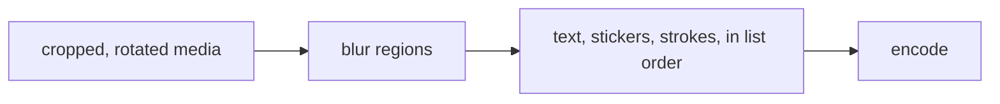

# Annotations

Four primitives cover everything an author draws on media, burned into a still or into every frame of a clip.

| Type | What it is |
|---|---|
| `TextAnnotation` | Text, optionally on a plate. Emoji are text. |
| `StickerAnnotation` | An image file composited into a rect. |
| `BlurAnnotation` | A region of the media blurred out. |
| `StrokeAnnotation` | A freehand coloured line. |

They are ordinary values on the edit, so they take part in undo and in re-applying an edit to the original:

```dart
ImageEdit.none
    .withAnnotation(caption)
    .withAnnotation(sticker)
    .withoutAnnotation(someId)
    .updatingAnnotation(movedCaption);   // matches on id
```

## The coordinate system

**Everything is normalized against the output frame** -- the frame as it looks after the crop and the rotation.

That is the frame the author was looking at when they placed it, which has two consequences worth relying on.
Changing the crop does not move a caption out from under the author.
And the same annotation means the same thing in a JPEG and in every frame of an MP4, because both are measured against their own output.

`Offset(0.5, 0.5)` is the centre of the output; `CropRect(left: 0, top: 0, width: 0.5, height: 1)` is its left half.

Sizes are fractions too, so an annotation looks the same on a 720p export and a 4K one:

- `TextAnnotation.heightFraction` -- cap height as a fraction of the output's **height**.
- `StrokeAnnotation.widthFraction` -- line weight as a fraction of the output's **shorter edge**, so a line keeps its weight whichever way the frame is turned.

## Paint order

The list paints back to front: the last annotation is on top.

Blur is the exception and is applied **beneath** the other three regardless of list position.
Blur samples the media, so it belongs to the picture; a caption drawn across a blurred face has to stay legible, and a naive back-to-front pass would blur the caption instead.



## Text and emoji

```dart
TextAnnotation(
  text: 'Hello',
  center: const Offset(0.5, 0.8),
  heightFraction: 0.08,
  colorArgb: 0xFFFFFFFF,
  backgroundArgb: 0x99000000,   // null draws no plate
  rotation: 0,                  // clockwise radians
);
```

**An emoji is text.**
It is a glyph the platform already knows how to shape, so there is no emoji primitive, no emoji asset table to keep current, and no emoji renderer to fall behind Unicode.
`AnnotationFactories.emoji` exists only so calling code reads right:

```dart
AnnotationFactories.emoji('🎉', center: const Offset(0.2, 0.2));
```

The plate (`backgroundArgb`) is a rounded rectangle behind the glyphs with padding derived from the type size.
It is worth using over busy media -- and it is what makes text position testable, since a glyph's exact coverage depends on each platform's font stack while a plate does not.

## Stickers

```dart
StickerAnnotation(
  imagePath: '/path/to/badge.png',
  rect: const CropRect(left: 0.6, top: 0.1, width: 0.3, height: 0.3),
  rotation: 0,
  opacity: 1,
);
```

A sticker is any PNG or JPEG on disk.
A file rather than bytes for the same reason media is path-first: the platform reads it directly, and a sticker sheet should not transit the Dart heap.

**A sticker fills its rect; it is not fitted inside it.**
Both platforms stretch the bitmap to the rect, so a square sticker in a wide rect comes out wide.
This is the one primitive whose preview can silently disagree with its export -- a host drawing the preview with `BoxFit.contain` gets a sticker that looks right until it is exported.
Draw previews with `BoxFit.fill`, and make placement rects square *in pixels* rather than in normalized units; [building an editor](./30-building-an-editor.md#the-square-rect-trap) has the arithmetic.

A missing or unreadable sticker file costs that sticker, not the export.

## Blur

```dart
BlurAnnotation(
  rect: faceRect,
  strength: 0.5,              // 0-1
  shape: BlurShape.oval,      // or rectangle
);
```

`strength` scales against the region's own shorter edge rather than being an absolute radius.
A radius chosen for a large box would erase a small one entirely, and an absolute radius would mean different things at different export resolutions.

Blur is the only primitive that **samples the media**, which is why it cannot be flattened into the overlay layer with the others and why it takes a different route on each platform:

| | Stills | Clips |
|---|---|---|
| iOS | Core Image `blendWithMask` | The same, per frame |
| Android | Per-region separable box blur | A custom masked-blur `GlEffect` |

The Android video case is the only place monolens writes a shader.
Media3's stock `GaussianBlur` blurs the whole frame with no mask, and no chain of stock effects recovers the sharp part, because an overlay draws *onto* a frame rather than reading it.
See [architecture](../20-reference/20-architecture.md#the-video-pipeline).

## Strokes

```dart
StrokeAnnotation(
  points: [const Offset(0.1, 0.5), const Offset(0.9, 0.5)],
  colorArgb: 0xFFE5484D,
  widthFraction: 0.012,
);

stroke.extendedTo(nextPoint);   // what a drag calls, once per sample
```

Points are normalized and in draw order.
A single point renders as a dot, so a tap is not nothing.

## Working with the list

`AnnotationList` is an extension on `List<Annotation>`, pure so it composes with any state management:

| Method | Notes |
|---|---|
| `replacing(annotation)` | Matches on `id`. What a drag calls. |
| `removing(id)` | |
| `bringingToFront(id)` | Moves to the end of the paint order. |
| `byId(id)` | Null when absent. |
| `isFlattenable` | True when nothing samples the source -- no blur. |

Every annotation carries a stable `id`, minted on construction or supplied by you.
Ids are what let a host select, move and delete one, and what let undo tell "moved the caption" from "added a second caption".
