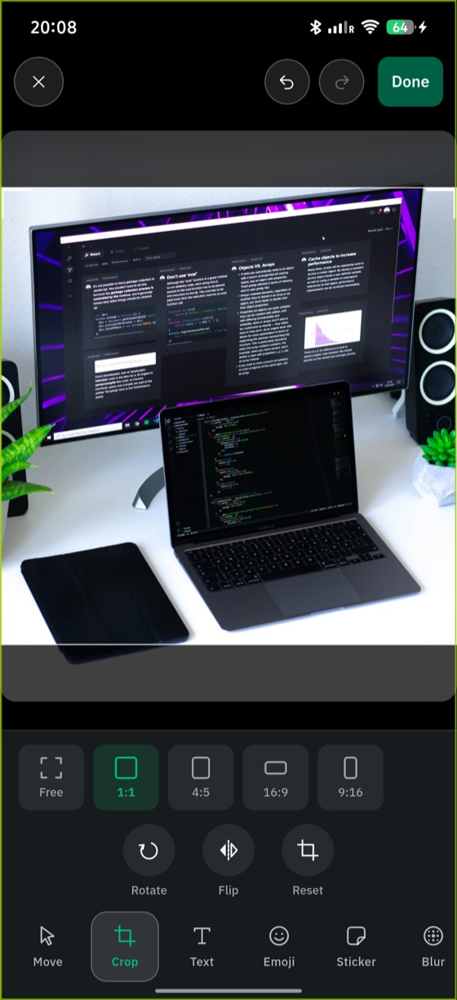

# Edit a still

Everything goes through `MediaEditor`.
An `ImageEdit` describes a *result*, so it re-applies to the untouched original every time -- stacking a crop and two rotations costs one encode, not three.

```dart
final result = await editor.applyImageEdit(
  source.path,
  ImageEdit(
    crop: const CropRect(left: 0.25, top: 0, width: 0.5, height: 1),
    rotation: MonoRotation.quarterTurn,
    flipHorizontal: true,
    maxDimension: 2048,
    format: MonoImageFormat.jpeg,
    quality: 90,
    annotations: [...],
  ),
);
```

| Field | Notes |
|---|---|
| `crop` | Normalized fractions. Defaults to the whole frame. |
| `rotation` | Clockwise quarter turns. |
| `flipHorizontal` | Mirrors the rotated frame. |
| `maxDimension` | Caps the longest edge after crop and rotation. |
| `format`, `quality` | `quality` is JPEG only, 1--100. |
| `annotations` | See [annotate media](./60-annotate-media.md). |

The order is fixed and identical on both platforms:

**crop -> rotate -> flip -> downscale -> annotate -> encode**

Two clauses of that order will surprise you if you assume otherwise: the flip mirrors the **rotated** frame, and annotations are positioned against the **output** frame, after crop and rotation.
[Architecture](../20-concepts/90-architecture.md#the-image-pipeline) explains why each is pinned.

## Probe before you decide

```dart
final info = await editor.probe(path);   // dimensions, duration, size
```

Cheap: no full decode.

## Skip the no-op

```dart
if (edit.isIdentity) return original;                       // stills
if (edit.isIdentityFor(clip.duration)) return original;     // clips
```

An identity edit would still cost a full decode and re-encode, and would still lose a generation of quality.
Checking is the difference between a free "Done" and a pointless export.

## Seed and clamp a crop

`CropRect` carries the fiddly geometry so your UI does not have to:

```dart
CropRect.full();                                              // identity
CropRect.centered(aspectRatio: 1, sourceAspectRatio: 16 / 9); // largest 1:1 that fits
someRect.clampedToBounds();                                   // slide back inside
```

Call `clampedToBounds()` on every frame of a drag rather than at the end, so the rect can never leave the frame in the first place.



Note that crop mode shows the *whole* frame with the crop region picked out,
rather than showing only what survives -- an author cannot judge a crop they
cannot see the outside of. [Rendering the canvas](./70-render-the-editing-canvas.md)
covers swapping between the two.

Crops are fractions rather than pixels because a crop UI works in layout space, whose size changes with rotation, insets and screen size -- see [architecture](../20-concepts/90-architecture.md#crops-are-normalized-end-to-end).

## Put the output where you want it

Output goes to the app's cache directory by default, which the OS may evict -- copy anything that has to outlive the session.

`MonolensEditor` takes an `outputPath` builder if you want to place files yourself, which is also how tests write into a directory they control.
