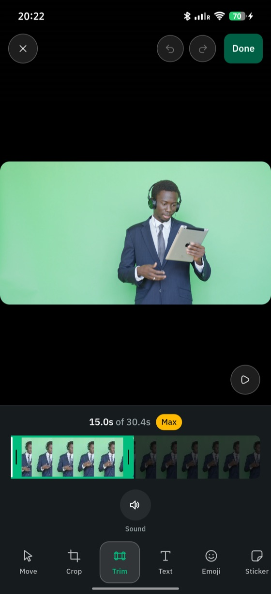
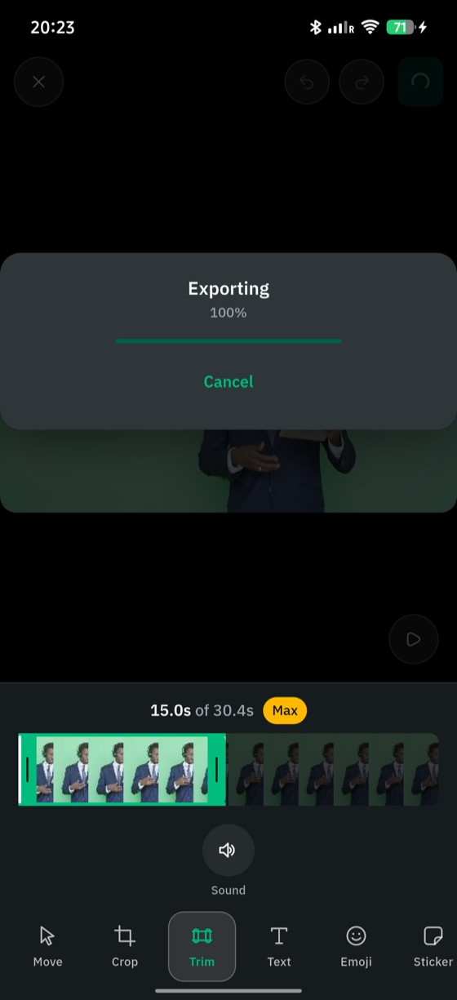

# Trim a clip

A clip export is the one operation slow enough to need a progress bar and a cancel button, so it hands back a job rather than a bare `Future`.

```dart
final job = editor.startTrim(
  source.path,
  VideoEdit(
    trim: const VideoTrim(
      start: Duration(milliseconds: 1500),
      end: Duration(milliseconds: 3500),
    ),
    crop: someRect,
    rotation: MonoRotation.quarterTurn,
    flipHorizontal: true,
    muteAudio: true,
    annotations: [...],
  ),
);
```

`VideoTrim` is an absolute start and end, not a start plus a length, because both handles are dragged independently and a length would have to be recomputed on every frame of a left-handle drag.

Muting drops the audio track rather than exporting a silent one, which is bytes an upload does not need.

Cuts are frame-accurate: both platforms re-encode rather than cutting on the nearest keyframe.
[Architecture](../20-concepts/90-architecture.md#the-video-pipeline) explains what that costs and why passthrough was rejected.

## Enforce minimum and maximum length while dragging

`clamped` holds whichever handle you are *not* dragging:



That readout is `clamped` doing its work -- the source is 30.4s, the cap is
15s, and the badge says which limit stopped the handle. The strip itself is
`editor.filmstrip()`, and the speaker toggle is `muteAudio`.

```dart
trim.clamped(
  clip.duration,
  minimum: const Duration(milliseconds: 500),
  maximum: const Duration(seconds: 15),
  anchorStart: true,   // the start is fixed; push the end
);
```

## Show progress, and let it be cancelled

```dart
job.id;                                    // addresses this export
job.progress.listen(...);                  // 0.0-1.0, broadcast, closes on completion
await job.cancel();                        // result then throws TrimCancelled
final CapturedVideo result = await job.result;
```

**Handle `TrimCancelled` separately from `MediaEditException`.**
Cancelling is not a failure: drop it silently rather than showing the banner a real error gets.



`job.progress` drives the bar and `job.cancel()` is behind that button.

```dart
try {
  final result = await job.result;
} on TrimCancelled {
  // The author cancelled. Say nothing.
} on MediaEditException catch (e) {
  showBanner(e.code);   // monolens/decode-failed, monolens/export-failed, ...
}
```

## Build a filmstrip for the scrubber

```dart
final frames = await editor.filmstrip(
  clip.path,
  duration: clip.duration,
  frames: 12,
  maxDimension: 160,
);
```

Encoded JPEG bytes, one per frame, in time order.
Frames are sampled at their *centres* rather than at clip edges, because the first and last frames of a recording are often a black lead-in or a motion-blurred stop.

An unreadable frame comes back empty rather than failing the whole strip, so a scrubber shows a gap instead of nothing.
