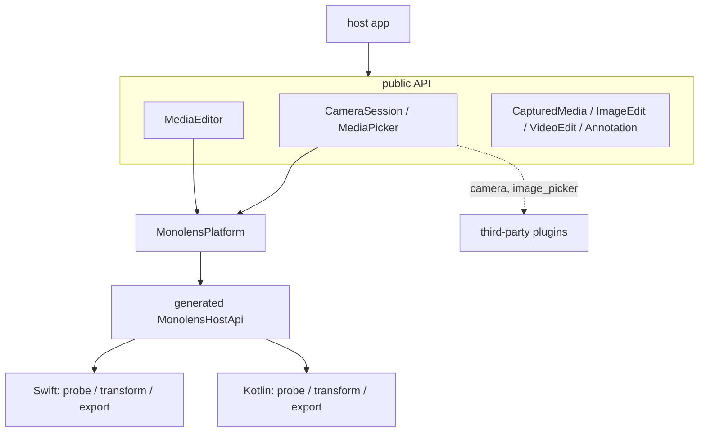
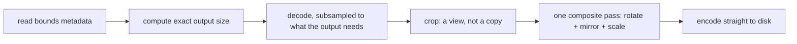
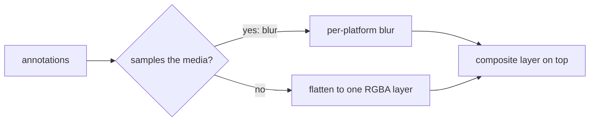

# Architecture

Monolens is a headless Flutter plugin for camera capture and on-device media editing.
Headless is the organizing constraint, not a detail: the package exports no widget, and every boundary it draws follows from that.
Capture hands back a texture id and the geometry to orient it; editing takes a file path and a declarative spec and returns a new file.
What the author sees is the host's to build.

This document is the shape and the reasoning.
How to *use* any of it is in the guides -- [capture](../10-guides/00-capture.md), [editing](../10-guides/10-editing.md), [annotations](../10-guides/20-annotations.md) -- and the full surface is in the [API reference](./00-api.md).
This is why it looks the way it does.

## Why headless

A media plugin that ships widgets asks every consumer to accept its design language, or to fight it.
Monolens was originally built with three of them -- a viewfinder, a crop surface, a trim scrubber -- and they were the largest and least reusable part of the package.
Dropping them removed roughly a third of the code and every styling seam that came with it, and the surviving API got sharper: the geometry types that had existed to serve those widgets turned out to be the useful part.

The rule this leaves is checkable.
Nothing in `lib/` imports `package:flutter/widgets.dart` or `material.dart` at all.
What it does import is `foundation` (for `ValueListenable`, which is how a recording's state is observed) and `services` (for `PlatformException`), plus `Size` from `dart:ui` -- none of which can render anything.
A grep for `widgets.dart` under `lib/` returning nothing is the invariant.

The cost lands in exactly one place.
A camera preview is a platform texture, so the host must render `Texture(textureId: ...)` itself and apply the rotation Android needs.
[Capture](#capture) covers what monolens hands over to make that a few lines rather than a research project.

## Layers

Dependency direction is one-way: `host -> api -> seam -> bridge -> native`.
Nothing in `src/edit/` knows about capture, and nothing in `src/capture/` knows about editing.
The two meet only in the host, and in `CapturedMedia`, which both produce and consume.

| Directory | Role |
|---|---|
| `src/capture/` | `CameraSession` and `MediaPicker`, their contracts, and the `camera`/`image_picker` implementations. |
| `src/edit/` | `ImageEdit`, `VideoEdit`, `VideoTrim`, `CropRect`, the sealed `Annotation` types, `EditHistory`, `MediaEditor` and the `TrimJob` handle. |
| `src/media/` | `CapturedMedia` and its two subtypes -- the currency both halves trade in. |
| `src/platform/` | `MonolensPlatform`, the mockable seam over the generated bridge. |
| `src/messages.g.dart` | Generated. Never edited by hand. |

## The bridge

All platform traffic goes through [Pigeon](https://pub.dev/packages/pigeon).
`pigeons/monolens_api.dart` is the single source of truth; the Dart, Swift and Kotlin bindings are generated from it and committed, so a consumer never needs pigeon installed and CI fails if the three drift from the schema.

Hand-written method channels were never a serious option here.
The payloads are structured -- a crop rectangle, a rotation enum, a trim range, a media descriptor -- and a stringly-typed channel turns every one of those into a map literal that three languages have to agree about by convention.
Pigeon makes the compiler enforce it, and a schema change that breaks a platform breaks the build rather than a device.

The surface is deliberately small.

| Call | Direction | Purpose |
|---|---|---|
| `cacheDirectory()` | host -> platform | Where exports are written. |
| `probe(path)` | host -> platform | Dimensions, duration and size, without a full decode. |
| `editImage(request)` | host -> platform | Crop, rotate, flip, downscale, re-encode. |
| `trimVideo(request, jobId)` | host -> platform | Re-encode a range to a new file. |
| `cancel(jobId)` | host -> platform | Abandon an in-flight export. |
| `videoThumbnails(path, atMs, max)` | host -> platform | Filmstrip frames. |
| `onProgress(jobId, progress)` | platform -> host | Export progress. |

`cacheDirectory` exists so the plugin carries no `path_provider` dependency.
The native side is opening files anyway and already knows where its own cache lives, so asking it for one string is cheaper than a dependency -- and that dependency turned out to be actively hostile, since its transitive `jni` package breaks under AGP 9.

### The platform seam

`MonolensPlatform` is an interface in front of the generated `MonolensHostApi` rather than a direct call into it.

That indirection buys two things.
Tests run the whole editor -- job handles, progress streams, cancellation, error mapping -- against `FakeMonolensPlatform` with no channel and no device, which is what keeps the unit suite meaningful rather than a set of assertions about plumbing.
And it is the line a federated split would cut along: `monolens_platform_interface`, `monolens_ios` and `monolens_android` fall out of this seam without touching a single caller.
The package is not federated today because one package is simpler and nothing yet needs per-platform versioning.

`PigeonMonolensPlatform` is the default implementation, and it is also the `MonolensFlutterApi` receiver -- it turns the reverse channel's progress callbacks into a broadcast `Stream<TrimProgress>` that `MediaEditor` filters by job id.

## Value types

### Edits are declarations, not commands

`ImageEdit` and `VideoTrim` describe a result, not a sequence of operations applied to a buffer.

That is what makes an edit re-applicable to the original.
Rotating twice and cropping does not stack three encodes with three rounds of generation loss; it produces one `ImageEdit`, applied once, to the untouched source.
"Revert" is `ImageEdit.none`, not an undo stack.
And a host can persist an edit next to the original as a few numbers, then re-derive the output whenever it likes.

`isIdentity` and `isIdentityFor` exist so a caller can skip the export entirely when nothing would change, which is the difference between a free "Next" and a pointless re-encode.

### Crops are normalized end to end

`CropRect` is fractions of the frame, and those fractions travel all the way to the platform as `NormalizedRect`.

A crop UI works in layout space, whose size changes with rotation, insets and screen size, so a pixel rect captured against one preview size is wrong at the next.
Fractions survive that.
Resolving them natively -- rather than in Dart against a probed size -- removes a round trip per edit, because the platform is opening the file anyway, and removes the possibility of the two sides disagreeing about what the source's dimensions are.

The fixed order is **crop, rotate, flip, downscale, encode**, and the flip mirrors the *rotated* frame.
That last clause is not pedantry: the two platforms originally composed it differently, and the mismatch produced correctly-sized, visibly wrong images for any rotate-plus-flip combination.
It is now pinned by pixel-level tests on both.

### Media is path-first

`CapturedMedia` carries a path, not bytes.

A 25 MB clip should not sit in the Dart heap to be previewed, and every native operation reads and writes files regardless.
`readBytes()` exists for the one moment that genuinely needs them, which is usually an upload.
`MediaOrigin` records where the media came from, because a camera clip is length-capped at the shutter while a gallery import is whatever the library holds and has to be re-checked.

Outputs land in the app's cache directory, which the OS may evict; anything that must outlive the session is the host's to copy.

## Capture

`CameraSession` owns one device at a time and rebuilds it whenever the lens or the capture mode changes.
Neither can be swapped on a live controller, and mode matters beyond that: video needs the microphone and a still does not, so claiming the mic only when video is actually selected keeps a photo-only author from ever seeing a prompt they do not need.

### The preview contract

`session.preview` returns a `PreviewTexture` or null.

| Field | Why the host needs it |
|---|---|
| `textureId` | The id for a `Texture` widget. Zero is valid -- an iPhone reports exactly that -- so test the null, not the id. |
| `size` | The stream's dimensions, in sensor orientation. |
| `sensorOrientation` | Degrees the sensor is mounted clockwise. Android streams unrotated; iOS has already applied it. |
| `facing` | Which lens, so the host can mirror the front one. |
| `aspectRatio` | `size` with the sensor orientation folded in -- the ratio the preview should occupy. |

Mirroring the front lens is a presentation choice, so it stays with the host.
So does device-orientation handling beyond the sensor's own mounting, which only a host knows the policy for.

### Permissions

Monolens does not depend on a permissions plugin and never prompts.

Most apps already broker permissions through something -- Monorithm has a scoped `PermissionsService` -- and two competing requesters produce two dialogs and a confused user.
`initialize` reports what it found as `CameraAccess`, distinguishing a plain denial from a permanent one so the host can decide between a rationale and a deep link to Settings.

### The recording cap

`startVideoRecording(maxDuration:)` stops the take itself.

The session clears `isRecording` when the cap is reached, and that flag is the host's cue to collect the file -- the same cue a second shutter tap produces.
Enforcing the limit at the shutter means a capped composer never has to reject its own recording after the fact, which is a strictly worse experience than not letting it happen.

## Editing

### The image pipeline

Both platforms run the same four-step shape.

Computing the output size first, from metadata alone, is what makes the rest possible.
The decoder is then asked for only as many pixels as that output needs -- `kCGImageSourceThumbnailMaxPixelSize` on iOS, `inSampleSize` on Android -- so cropping a 12 MP photo to a 1080 px square never materialises the 12 MP bitmap.
On Android that is also what keeps the operation off the OOM killer's radar.

Because the size is derived from full-resolution metadata rather than from whatever the decoder returned, output dimensions are exact regardless of how far it subsampled.
The crop is then rescaled into the decoded image rather than assumed to match it.

Rotation, mirroring and the final scale collapse into one pass: `CGImage.cropping` returns a view rather than a copy, and Android's `createBitmap` accepts a sub-rectangle and a matrix together.
When the crop alone is the answer, that pass is skipped and the cropped image is encoded directly.
This replaced a full-resolution decode followed by up to three full-size redraws.

EXIF orientation is handled in the decode itself (`kCGImageSourceCreateThumbnailWithTransform`, or a single normalize pass on Android), so everything downstream works in the upright space the crop fractions were measured against.

### The video pipeline

Trimming is `AVAssetExportSession` on iOS and `androidx.media3.transformer.Transformer` on Android.

There is no ffmpeg, and that is not an accident of taste.
`ffmpeg_kit` is retired, and the platform encoders are the maintained path -- they also mean no bundled native binary and no per-ABI size cost, and the work lands on hardware.

Cuts are frame-accurate by choice.
Passthrough export is far faster but can only cut on sync samples, so an in-point between keyframes silently slides backwards by up to a GOP.
That is fine for a rough cut and wrong when an author has just placed a handle on a specific frame, so both platforms force a re-encode: iOS by using a quality preset rather than `AVAssetExportPresetPassthrough`, Android by leaving `ClippingConfiguration.setStartsAtKeyFrame` false.

Muting drops the audio track rather than exporting a silent one, because a silent AAC track is bytes an upload does not need.

`TrimJob` is a handle rather than a bare `Future` because an export is the one operation here slow enough to need a progress bar and a cancel button.
A 15 second clip is a few hundred milliseconds on a recent phone; a minute of 4K on an old one is not.
Cancellation is the subtle part: `Transformer.cancel()` fires no listener callback, so the Android side settles the pending result itself, exactly once, or the awaiting Dart future would hang forever.

### Annotations

Four primitives cover the whole list of things an author draws on media: text (emoji included, because an emoji is a glyph the platform already shapes), stickers, blur regions, and freehand strokes.
A sticker fills its rect rather than fitting inside it, which is worth stating because it is the one primitive whose preview can disagree with its export: a host that draws the preview with `BoxFit.contain` gets a sticker that looks right until it is exported.
Collapsing emoji into text is the single largest simplification here - the alternative is an emoji asset table that is out of date the week it ships.

Geometry is normalized against the **output** frame rather than the source.
That is the only interpretation that survives a change of crop, and the only one that means the same thing for a still and for every frame of a clip.

The split that shapes the implementation is blur versus everything else.
Text, stickers and strokes never read the media, so they flatten into one transparent RGBA layer: drawn once for a still, handed to the compositor as a static overlay for a clip.
Blur samples the media, so it cannot be flattened, and it is applied *beneath* the other three - a caption drawn across a blurred face has to stay legible.

One renderer per platform serves both media types, which is what keeps a caption in the same place in a JPEG and in an MP4.

### Undo

`EditHistory` is a stack of previous values, and that is the whole design.

Undo is cheap here only because an edit is a value rather than a command log: there is nothing to invert and nothing to replay.
A mutable canvas would have needed an inverse per operation, and blur has none.
Gestures coalesce under a key, so dragging a sticker is one entry rather than four hundred, and the class implements `ValueListenable` so it binds to any UI library rather than to one.

### Filmstrips

`filmstrip` samples frame centres rather than clip edges, because the first and last frames of a recording are often a black lead-in or a motion-blurred stop, and a strip of those reads as a broken decode.

iOS batches every requested timestamp through `generateCGImagesAsynchronously`, so AVFoundation walks the file once instead of re-seeking per frame.
Android decodes straight to thumbnail size with `getScaledFrameAtTime` where the API level allows.
Both accept seek tolerance: a filmstrip is a scrubbing aid, and exact seeking costs an order of magnitude for no visible gain.
A frame that fails to decode comes back empty rather than failing the whole strip.

## Threading

Every native operation runs off the platform thread.
Decoding a 12 MP still on it would stall the viewfinder the author is looking at.

iOS dispatches onto a concurrent queue and posts replies back to main, which is where Pigeon's reply handlers expect to be.
Android uses a cached thread pool for probe, image and thumbnail work.
Trimming is the exception on both: Media3's `Transformer` is single-threaded on the looper it was built on and throws if cancelled from elsewhere, so the Android exporter confines itself to the main looper and lets Transformer manage its own workers.

## Errors

Native failures cross the bridge as codes and surface in Dart as typed exceptions.

| Code | Dart |
|---|---|
| `monolens/cancelled` | `TrimCancelled` |
| everything else | `MediaEditException` with the code and message |

Cancellation gets its own type because it is not a failure.
A composer should drop it silently rather than show the banner it shows for a real export error, and a shared exception type makes that a string comparison at every call site instead of a `catch` clause.

## Testing

Three tiers, each answering something the others cannot; [testing](../10-guides/40-testing.md) is the working guide.

| Tier | Runs on | Answers |
|---|---|---|
| Unit + fakes | Any machine, no device | Does the Dart layer do the right thing -- job lifecycle, cancellation, clamping, request shape? |
| Integration | Device, simulator or emulator | Does the native code actually work? |
| Pixel-level | Same | Is the *picture* right, not just its dimensions? |

`FakeMonolensPlatform` records requests rather than producing bytes, so a test asserts on intent -- the normalized crop, the trim range in milliseconds -- instead of decoding an image to find out what happened.
It also yields between progress ticks, because a real export never delivers progress in the same microtask as its result and a fake that does would hide a real ordering bug.

The integration fixtures are generated, not committed: `swift tool/make_fixture.swift` writes a five second clip with a keyframe every second, so a mid-GOP cut is genuinely exercised, and an 800x600 still divided into coloured quadrants.
The quadrants are the point of the third tier.
Dimensions alone cannot catch a transform composed in the wrong order -- it gets the size right and the picture wrong -- so those tests decode the output and assert which colour landed in which corner.
That is what caught the cross-platform flip ordering, and what keeps it caught.

Camera tests skip where no camera exists, run on an Android emulator's virtual scene, and run on real hardware.
They carry a long timeout because opening a camera on an emulator can take minutes, which is emulator slowness rather than anything about the plugin.

## Platform divergences

Most of the surface is symmetric.
These are the places it is not, and they are load-bearing.

| Concern | iOS | Android |
|---|---|---|
| Preview rotation | Frames arrive oriented | Streams in sensor orientation; host rotates |
| Trim engine | `AVAssetExportSession` | Media3 `Transformer` |
| Trim threading | Any queue | Main looper only |
| Cancellation | `cancelExport()` reports `.cancelled` | Fires nothing; the exporter settles the result |
| Image decode | `CGImageSourceCreateThumbnailAtIndex` | `BitmapFactory` with `inSampleSize` |
| Filmstrip | Batched via `generateCGImagesAsynchronously` | Per-frame `getScaledFrameAtTime` |
| Still blur | Core Image `blendWithMask` | Per-region separable box blur |
| Video blur | Core Image, per frame | Custom masked-blur `GlEffect` |
| Video overlay | Composited in the CI pass | Media3 `OverlayEffect` |

Video blur on Android is the one place monolens writes a shader.
Everything else about a clip flattens into an overlay bitmap that Media3 composites per frame, but blur samples the frame, and no chain of stock effects recovers the sharp part -- Media3's `GaussianBlur` takes no mask, and an overlay draws onto a frame rather than reading it.

The mask is rasterized once by the same Canvas code the still path uses and uploaded as a texture, rather than passed as array uniforms.
That is not a stylistic choice: GLES reports an array uniform under the name `uRegions[0]`, so binding it by the name written in the source silently fails, and it keeps the oval geometry in one place instead of re-derived in GLSL.
Fragments outside every region cost a single texture fetch, which is most of the frame.

Two floors constrain the native code: iOS 13, which is why the encoder uses raw UTI strings rather than `UTType`, and Android minSdk 24, which is why `getScaledFrameAtTime` is guarded.
[Platform notes](./10-platforms.md) lists every divergence, including the ones handled internally.

## Extending it

Adding an operation means editing `pigeons/monolens_api.dart`, regenerating, implementing on both platforms, and widening `MonolensPlatform` plus its fake.
The fake is not optional -- an operation with no test double is one no host can write a test around.

The practical steps are in [contributing](https://github.com/monorithm/monolens/blob/main/docs/contributing.md#adding-an-operation).
Federating the package is the seam described above and touches no caller.
Voice recording deliberately stays out of scope: monolens is lens-shaped, and `record` is already the right tool for an AAC file.
