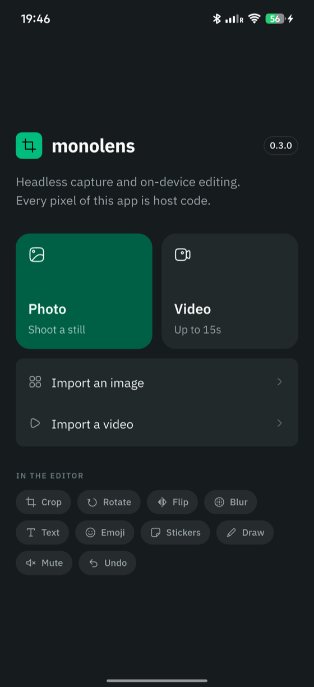

# monolens

Headless camera capture and on-device media editing for Flutter -- crop, rotate, trim, blur, annotate.
No ffmpeg, no widgets.

A camera, an editor and a frame-accurate video trim that hand back textures and files instead of screens.
What the author sees is yours to build.

```bash
flutter pub add monolens
```

**New here? Start with [your first edit](00-start/00-tutorial.md)** -- one guided build, from an empty project to a captured photo with a caption burned into it.



The screenshots through these pages are the example app in `example/`, running
on a device. It is a complete editor built entirely on the public API -- which
is the point: monolens ships no widgets, so everything you can see there is
code you would own.

## The four kinds of page

| | For when you want to |
|---|---|
| [Start](00-start/00-tutorial.md) | learn the package by building something with it |
| [Recipes](10-recipes/00-capture-a-photo-or-video.md) | get one specific job done |
| [Concepts](20-concepts/00-what-is-monolens.md) | understand why it is shaped this way |
| [Reference](30-reference/00-api-map.md) | look something up |

Each page is one of those and not the others, which is what keeps them short.

## Recipes

- [Capture a photo or a video](10-recipes/00-capture-a-photo-or-video.md)
- [Render the viewfinder](10-recipes/10-render-the-viewfinder.md)
- [Import from the gallery](10-recipes/20-import-from-the-gallery.md)
- [Edit a still](10-recipes/30-edit-a-still.md)
- [Trim a clip](10-recipes/40-trim-a-clip.md)
- [Wire undo and redo](10-recipes/50-wire-undo-and-redo.md)
- [Annotate a photo or a clip](10-recipes/60-annotate-media.md)
- [Render the editing canvas](10-recipes/70-render-the-editing-canvas.md)
- [Handle editor gestures](10-recipes/80-handle-editor-gestures.md)
- [Test without a camera or a device](10-recipes/90-test-without-hardware.md)

## Concepts

- [What is monolens?](20-concepts/00-what-is-monolens.md) -- what the package does, what headless means in practice, and why there is no ffmpeg.
- [Architecture](20-concepts/90-architecture.md) -- why the package is headless, how the native bridge is drawn, and what each boundary buys.

## Reference

- [API map](30-reference/00-api-map.md) -- the public surface grouped by what it is for, and what is deliberately absent.
- [Platform notes](30-reference/10-platforms.md) -- requirements, permissions, and the places the two platforms differ.

---

monolens is on [pub.dev](https://pub.dev/packages/monolens), and its API
signatures are at
[pub.dev/documentation/monolens/latest](https://pub.dev/documentation/monolens/latest/).

To work on the package itself rather than with it, see
[CONTRIBUTING.md](https://github.com/monorithm/monolens/blob/main/CONTRIBUTING.md).

## Credits

The photograph in the editing screenshots is by
[Walling](https://unsplash.com/@walling?utm_source=unsplash&utm_medium=referral&utm_content=creditCopyText)
on [Unsplash](https://unsplash.com/photos/black-laptop-computer-turned-on-beside-white-and-black-robot-toy-SQIpFNb0Nk4?utm_source=unsplash&utm_medium=referral&utm_content=creditCopyText).
The clip in the trim and export screenshots is by
[Monstera Production](https://www.pexels.com/video/man-wearing-headphones-using-a-tablet-9465045/)
on Pexels.
